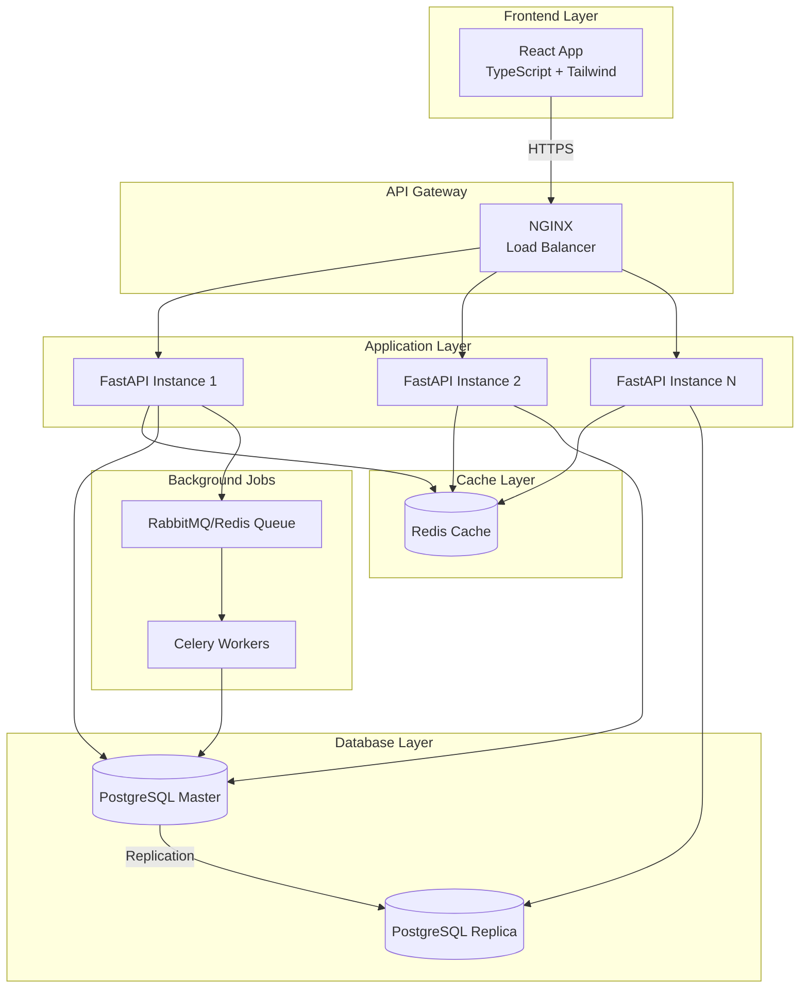

# 🏗️ ERP Backend Architecture Documentation
## FastAPI + PostgreSQL Implementation Guide

**Version**: 1.0.0
**Created**: September 2025
**Stack**: FastAPI + PostgreSQL + SQLAlchemy + Alembic

---

## 📋 Table of Contents

1. [Architecture Overview](#architecture-overview)
2. [Technology Stack](#technology-stack)
3. [Database Design](#database-design)
4. [Project Structure](#project-structure)
5. [API Design Patterns](#api-design-patterns)
6. [Core Modules Implementation](#core-modules-implementation)
7. [Security & Authentication](#security-authentication)
8. [Deployment Strategy](#deployment-strategy)

---

## 🏛️ Architecture Overview



---

## 💻 Technology Stack

### Core Technologies

| Component | Technology | Version | Purpose |
|-----------|------------|---------|---------|
| **API Framework** | FastAPI | 0.100+ | High-performance async API |
| **Database** | PostgreSQL | 15+ | ACID-compliant relational DB |
| **ORM** | SQLAlchemy | 2.0+ | Async ORM with type hints |
| **Migration** | Alembic | 1.11+ | Database migrations |
| **Cache** | Redis | 7.0+ | Session & data caching |
| **Queue** | Celery | 5.3+ | Background job processing |
| **Message Broker** | RabbitMQ/Redis | Latest | Task queue management |
| **Validation** | Pydantic | 2.0+ | Data validation & serialization |
| **Authentication** | JWT + OAuth2 | - | Secure authentication |
| **Testing** | Pytest | 7.0+ | Async testing framework |
| **Documentation** | OpenAPI/Swagger | 3.0 | Auto-generated API docs |

### Python Dependencies

```python
# requirements.txt
fastapi==0.104.1
uvicorn[standard]==0.24.0
sqlalchemy==2.0.23
asyncpg==0.29.0
alembic==1.12.1
pydantic==2.5.0
pydantic-settings==2.1.0
python-jose[cryptography]==3.3.0
passlib[bcrypt]==1.7.4
python-multipart==0.0.6
redis==5.0.1
celery==5.3.4
pandas==2.1.3
numpy==1.26.2
python-dateutil==2.8.2
httpx==0.25.1
pytest==7.4.3
pytest-asyncio==0.21.1
black==23.11.0
ruff==0.1.6
```

---

## 🗄️ Database Design

### PostgreSQL Schema Architecture

```sql
-- Enable necessary extensions
CREATE EXTENSION IF NOT EXISTS "uuid-ossp";
CREATE EXTENSION IF NOT EXISTS "btree_gist";
CREATE EXTENSION IF NOT EXISTS "pg_trgm";

-- Create schemas for logical separation
CREATE SCHEMA IF NOT EXISTS core;        -- System tables
CREATE SCHEMA IF NOT EXISTS finance;     -- GL, AP, AR
CREATE SCHEMA IF NOT EXISTS inventory;   -- Stock, items
CREATE SCHEMA IF NOT EXISTS sales;       -- Sales transactions
CREATE SCHEMA IF NOT EXISTS audit;       -- Audit trails
```

### Core Tables Structure

```sql
-- Company/Tenant Management (Multi-tenant support)
CREATE TABLE core.companies (
    id UUID PRIMARY KEY DEFAULT uuid_generate_v4(),
    code VARCHAR(20) UNIQUE NOT NULL,
    name VARCHAR(200) NOT NULL,
    tax_id VARCHAR(50),
    fiscal_year_start DATE NOT NULL,
    base_currency CHAR(3) NOT NULL,
    settings JSONB DEFAULT '{}',
    is_active BOOLEAN DEFAULT true,
    created_at TIMESTAMPTZ DEFAULT CURRENT_TIMESTAMP,
    updated_at TIMESTAMPTZ DEFAULT CURRENT_TIMESTAMP
);

-- Users with company association
CREATE TABLE core.users (
    id UUID PRIMARY KEY DEFAULT uuid_generate_v4(),
    company_id UUID REFERENCES core.companies(id),
    username VARCHAR(100) UNIQUE NOT NULL,
    email VARCHAR(255) UNIQUE NOT NULL,
    hashed_password VARCHAR(255) NOT NULL,
    full_name VARCHAR(200),
    role VARCHAR(50) NOT NULL,
    permissions JSONB DEFAULT '[]',
    is_active BOOLEAN DEFAULT true,
    last_login TIMESTAMPTZ,
    created_at TIMESTAMPTZ DEFAULT CURRENT_TIMESTAMP,
    updated_at TIMESTAMPTZ DEFAULT CURRENT_TIMESTAMP
);

-- GL Chart of Accounts
CREATE TABLE finance.gl_accounts (
    id UUID PRIMARY KEY DEFAULT uuid_generate_v4(),
    company_id UUID REFERENCES core.companies(id),
    account_code VARCHAR(20) NOT NULL,
    account_name VARCHAR(200) NOT NULL,
    account_type VARCHAR(50) NOT NULL, -- Asset, Liability, Equity, Revenue, Expense
    parent_account_id UUID REFERENCES finance.gl_accounts(id),
    is_control_account BOOLEAN DEFAULT false,
    is_active BOOLEAN DEFAULT true,
    metadata JSONB DEFAULT '{}',
    created_at TIMESTAMPTZ DEFAULT CURRENT_TIMESTAMP,
    updated_at TIMESTAMPTZ DEFAULT CURRENT_TIMESTAMP,
    UNIQUE(company_id, account_code)
);

-- GL Journal Entries (Server-calculated only!)
CREATE TABLE finance.gl_journal_entries (
    id UUID PRIMARY KEY DEFAULT uuid_generate_v4(),
    company_id UUID REFERENCES core.companies(id),
    journal_number VARCHAR(50) UNIQUE NOT NULL,
    transaction_date DATE NOT NULL,
    posting_date DATE NOT NULL,
    reference_type VARCHAR(50), -- Invoice, Payment, CreditNote, etc.
    reference_id UUID,
    description TEXT,
    total_debit DECIMAL(15,2) NOT NULL,
    total_credit DECIMAL(15,2) NOT NULL,
    status VARCHAR(20) DEFAULT 'draft', -- draft, posted, reversed
    posted_by UUID REFERENCES core.users(id),
    posted_at TIMESTAMPTZ,
    created_at TIMESTAMPTZ DEFAULT CURRENT_TIMESTAMP,
    updated_at TIMESTAMPTZ DEFAULT CURRENT_TIMESTAMP,
    CHECK (total_debit = total_credit) -- Must balance!
);

-- GL Journal Lines
CREATE TABLE finance.gl_journal_lines (
    id UUID PRIMARY KEY DEFAULT uuid_generate_v4(),
    journal_entry_id UUID REFERENCES finance.gl_journal_entries(id),
    account_id UUID REFERENCES finance.gl_accounts(id),
    debit_amount DECIMAL(15,2) DEFAULT 0,
    credit_amount DECIMAL(15,2) DEFAULT 0,
    description TEXT,
    cost_center_id UUID,
    project_id UUID,
    metadata JSONB DEFAULT '{}',
    CHECK (
        (debit_amount > 0 AND credit_amount = 0) OR
        (credit_amount > 0 AND debit_amount = 0)
    )
);

-- Inventory Items with cost tracking
CREATE TABLE inventory.items (
    id UUID PRIMARY KEY DEFAULT uuid_generate_v4(),
    company_id UUID REFERENCES core.companies(id),
    item_code VARCHAR(50) NOT NULL,
    item_name VARCHAR(200) NOT NULL,
    category_id UUID,
    unit_of_measure VARCHAR(20),
    cost_method VARCHAR(20) DEFAULT 'FIFO', -- FIFO, LIFO, WEIGHTED_AVG
    standard_cost DECIMAL(15,4),
    last_cost DECIMAL(15,4),
    average_cost DECIMAL(15,4),
    selling_price DECIMAL(15,4),
    reorder_point DECIMAL(15,4),
    reorder_quantity DECIMAL(15,4),
    is_active BOOLEAN DEFAULT true,
    metadata JSONB DEFAULT '{}',
    created_at TIMESTAMPTZ DEFAULT CURRENT_TIMESTAMP,
    updated_at TIMESTAMPTZ DEFAULT CURRENT_TIMESTAMP,
    UNIQUE(company_id, item_code)
);

-- Inventory Cost Layers (for FIFO/LIFO)
CREATE TABLE inventory.cost_layers (
    id UUID PRIMARY KEY DEFAULT uuid_generate_v4(),
    item_id UUID REFERENCES inventory.items(id),
    transaction_date DATE NOT NULL,
    quantity DECIMAL(15,4) NOT NULL,
    unit_cost DECIMAL(15,4) NOT NULL,
    remaining_quantity DECIMAL(15,4) NOT NULL,
    reference_type VARCHAR(50),
    reference_id UUID,
    created_at TIMESTAMPTZ DEFAULT CURRENT_TIMESTAMP
);

-- Audit Trail (Automatic logging)
CREATE TABLE audit.audit_log (
    id UUID PRIMARY KEY DEFAULT uuid_generate_v4(),
    company_id UUID,
    user_id UUID,
    table_name VARCHAR(100) NOT NULL,
    record_id UUID NOT NULL,
    action VARCHAR(20) NOT NULL, -- INSERT, UPDATE, DELETE
    old_values JSONB,
    new_values JSONB,
    ip_address INET,
    user_agent TEXT,
    created_at TIMESTAMPTZ DEFAULT CURRENT_TIMESTAMP
);

-- Create indexes for performance
CREATE INDEX idx_gl_accounts_company ON finance.gl_accounts(company_id);
CREATE INDEX idx_gl_accounts_code ON finance.gl_accounts(company_id, account_code);
CREATE INDEX idx_gl_journal_entries_date ON finance.gl_journal_entries(company_id, transaction_date);
CREATE INDEX idx_gl_journal_entries_reference ON finance.gl_journal_entries(reference_type, reference_id);
CREATE INDEX idx_items_code ON inventory.items(company_id, item_code);
CREATE INDEX idx_audit_log_record ON audit.audit_log(table_name, record_id);
CREATE INDEX idx_audit_log_user ON audit.audit_log(user_id, created_at);
```

---

## 📁 Project Structure

```
erp-backend/
├── app/
│   ├── __init__.py
│   ├── main.py                 # FastAPI app initialization
│   ├── config.py                # Settings and configuration
│   ├── database.py              # Database connection and session
│   │
│   ├── core/                    # Core functionality
│   │   ├── __init__.py
│   │   ├── security.py          # Authentication & authorization
│   │   ├── dependencies.py      # Common dependencies
│   │   ├── middleware.py        # Custom middleware
│   │   ├── exceptions.py        # Custom exceptions
│   │   └── utils.py             # Utility functions
│   │
│   ├── models/                  # SQLAlchemy models
│   │   ├── __init__.py
│   │   ├── base.py              # Base model class
│   │   ├── company.py           # Company model
│   │   ├── user.py              # User model
│   │   ├── gl_account.py        # GL account model
│   │   ├── gl_journal.py        # GL journal models
│   │   ├── inventory.py         # Inventory models
│   │   └── audit.py             # Audit log model
│   │
│   ├── schemas/                 # Pydantic schemas
│   │   ├── __init__.py
│   │   ├── company.py           # Company schemas
│   │   ├── user.py              # User schemas
│   │   ├── gl.py                # GL schemas
│   │   ├── inventory.py         # Inventory schemas
│   │   └── common.py            # Common schemas
│   │
│   ├── api/                     # API endpoints
│   │   ├── __init__.py
│   │   ├── v1/
│   │   │   ├── __init__.py
│   │   │   ├── auth.py          # Authentication endpoints
│   │   │   ├── companies.py     # Company management
│   │   │   ├── users.py         # User management
│   │   │   ├── gl/              # GL module
│   │   │   │   ├── __init__.py
│   │   │   │   ├── accounts.py  # Chart of accounts
│   │   │   │   ├── journals.py  # Journal entries
│   │   │   │   └── calculations.py # GL calculations
│   │   │   ├── inventory/       # Inventory module
│   │   │   │   ├── __init__.py
│   │   │   │   ├── items.py     # Item master
│   │   │   │   ├── cost.py      # Cost calculations
│   │   │   │   └── movements.py # Stock movements
│   │   │   └── reports/         # Reporting endpoints
│   │
│   ├── services/                # Business logic layer
│   │   ├── __init__.py
│   │   ├── gl_service.py        # GL business logic
│   │   ├── inventory_service.py # Inventory business logic
│   │   ├── tax_service.py       # Tax calculations
│   │   └── audit_service.py     # Audit logging
│   │
│   ├── calculations/            # Complex calculations
│   │   ├── __init__.py
│   │   ├── gl_calculator.py     # GL calculations
│   │   ├── cost_calculator.py   # FIFO/LIFO/Weighted avg
│   │   ├── tax_calculator.py    # Tax calculations
│   │   └── forex_calculator.py  # Currency conversions
│   │
│   └── tasks/                   # Celery background tasks
│       ├── __init__.py
│       ├── celery_app.py        # Celery configuration
│       ├── gl_tasks.py          # GL background tasks
│       └── reporting_tasks.py   # Report generation
│
├── migrations/                  # Alembic migrations
│   ├── alembic.ini
│   ├── env.py
│   └── versions/
│
├── tests/                       # Test suite
│   ├── __init__.py
│   ├── conftest.py              # Test configuration
│   ├── test_gl/                 # GL tests
│   ├── test_inventory/          # Inventory tests
│   └── test_calculations/       # Calculation tests
│
├── scripts/                     # Utility scripts
│   ├── init_db.py               # Database initialization
│   └── seed_data.py             # Sample data seeding
│
├── docker/                      # Docker configuration
│   ├── Dockerfile
│   └── docker-compose.yml
│
├── .env.example                 # Environment variables example
├── requirements.txt             # Python dependencies
├── pytest.ini                   # Pytest configuration
└── README.md                    # Project documentation
```

---

**Document Version**: 1.0.0
**Last Updated**: September 2025
**Status**: Ready for Implementation