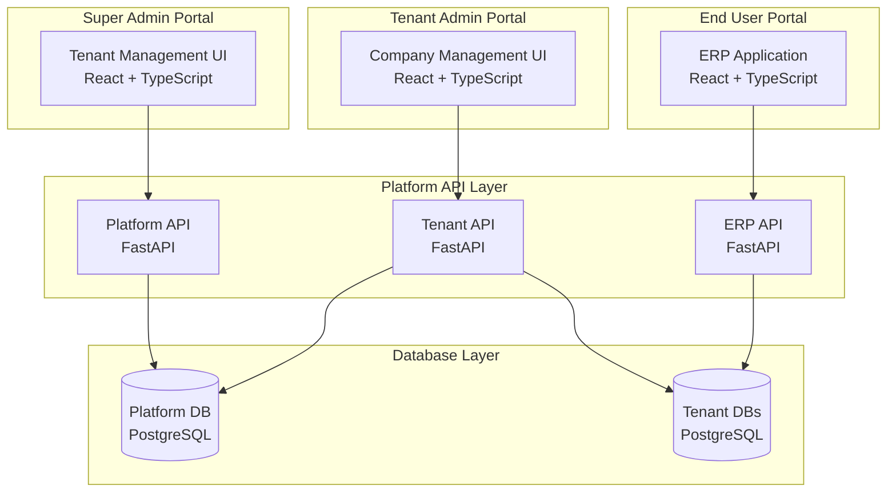

# 🏢 ERP Tenant Management Platform Documentation
## Multi-Tenant Architecture & Control System

**Version**: 1.0.0
**Purpose**: Complete guide for building an ERP operator platform to manage tenants, subscriptions, and licensing
**Scope**: Tenant creation, company limits, user limits, billing, monitoring

---

## 📋 Table of Contents

1. [Architecture Overview](#architecture-overview)
2. [Multi-Tenancy Strategy](#multi-tenancy-strategy)
3. [Database Design](#database-design)
4. [Tenant Management Features](#tenant-management-features)
5. [Subscription & Licensing](#subscription-licensing)
6. [Admin Portal Design](#admin-portal-design)
7. [Security & Isolation](#security-isolation)
8. [Implementation Roadmap](#implementation-roadmap)

---

## 🏛️ Architecture Overview

### Three-Tier Architecture



### User Hierarchy

```
┌─────────────────────────────────────┐
│       SUPER ADMIN (ERP Operator)    │
│   • Create/manage tenants            │
│   • Set subscription plans           │
│   • Monitor all tenants              │
└──────────────┬──────────────────────┘
               │
    ┌──────────┴──────────┐
    │                     │
┌───▼──────────┐  ┌───────▼──────────┐
│  TENANT 1    │  │    TENANT 2      │
│  Admin       │  │    Admin         │
│  • Companies │  │    • Companies   │
│  • Users     │  │    • Users       │
└───┬──────────┘  └────────┬─────────┘
    │                       │
┌───▼────────────────┐     │
│ COMPANY 1│COMPANY 2│     │
│  Users   │  Users  │     │
└────────────────────┘     │
                           │
                    ┌──────▼────────┐
                    │   COMPANY 1   │
                    │     Users     │
                    └───────────────┘
```

---

## 🔐 Multi-Tenancy Strategy

### Database Isolation Strategies

| Strategy | Description | Pros | Cons | Best For |
|----------|-------------|------|------|----------|
| **Shared Database, Shared Schema** | All tenants in same tables with tenant_id | Low cost, easy maintenance | Security risk, noisy neighbor | Small B2C SaaS |
| **Shared Database, Separate Schema** | Each tenant gets own schema | Good isolation, manageable | Complex migrations | SMB market |
| **Separate Database** ⭐🎯 | Each tenant gets own database | Best isolation, compliance friendly | Higher cost, complex ops | Enterprise ERP |
| **Dedicated Server** | Tenant gets dedicated infrastructure | Maximum isolation, custom config | Highest cost | Government/Healthcare |

### 🎯 Recommended: Separate Database for ALL Tenants

```python
# All tenants get separate databases for maximum security
class TenantTier(Enum):
    TRIAL = "trial"           # Separate database (14-day trial)
    STARTER = "starter"       # Separate database
    PROFESSIONAL = "pro"      # Separate database
    ENTERPRISE = "enterprise" # Separate database + dedicated resources
    DEDICATED = "dedicated"   # Separate server + database
```

**Why Separate Database for ERP?**
- ✅ **Complete data isolation** - No risk of data leaks between tenants
- ✅ **Independent scaling** - Each tenant can scale independently
- ✅ **Compliance ready** - Meets regulatory requirements
- ✅ **Easy backup/restore** - Per-tenant backup strategies
- ✅ **Performance isolation** - One tenant can't affect others
- ✅ **Simpler security** - Database-level access control

---

## 🗄️ Database Design

### Platform Database (Shared)

```sql
-- Platform management database
CREATE DATABASE platform_db;

-- Tenants table
CREATE TABLE tenants (
    id UUID PRIMARY KEY DEFAULT uuid_generate_v4(),
    tenant_code VARCHAR(50) UNIQUE NOT NULL,
    tenant_name VARCHAR(200) NOT NULL,
    domain VARCHAR(100) UNIQUE,  -- Custom domain
    subdomain VARCHAR(50) UNIQUE NOT NULL, -- *.yourerp.com

    -- Subscription details
    subscription_plan VARCHAR(50) NOT NULL,
    subscription_status VARCHAR(20) DEFAULT 'trial',
    trial_ends_at TIMESTAMP,
    subscription_starts_at TIMESTAMP,
    subscription_ends_at TIMESTAMP,

    -- Limits (from subscription plan)
    max_companies INTEGER DEFAULT 1,
    max_users_per_company INTEGER DEFAULT 5,
    max_transactions_per_month INTEGER DEFAULT 1000,
    storage_limit_gb INTEGER DEFAULT 10,

    -- Database configuration
    database_strategy VARCHAR(20) DEFAULT 'shared_schema',
    database_name VARCHAR(100),
    database_host VARCHAR(255),
    database_port INTEGER DEFAULT 5432,

    -- Features flags
    features JSONB DEFAULT '{}',
    modules_enabled JSONB DEFAULT '["core", "finance", "inventory"]',

    -- Billing
    billing_email VARCHAR(255),
    billing_contact VARCHAR(200),
    payment_method VARCHAR(50),
    stripe_customer_id VARCHAR(100),

    -- Metadata
    onboarding_completed BOOLEAN DEFAULT false,
    is_active BOOLEAN DEFAULT true,
    is_suspended BOOLEAN DEFAULT false,
    suspension_reason TEXT,

    created_at TIMESTAMP DEFAULT CURRENT_TIMESTAMP,
    updated_at TIMESTAMP DEFAULT CURRENT_TIMESTAMP,
    deleted_at TIMESTAMP
);

-- Subscription plans table
CREATE TABLE subscription_plans (
    id UUID PRIMARY KEY DEFAULT uuid_generate_v4(),
    plan_code VARCHAR(50) UNIQUE NOT NULL,
    plan_name VARCHAR(100) NOT NULL,
    description TEXT,

    -- Pricing
    monthly_price DECIMAL(10,2),
    annual_price DECIMAL(10,2),
    currency VARCHAR(3) DEFAULT 'USD',

    -- Limits
    max_companies INTEGER NOT NULL,
    max_users_per_company INTEGER NOT NULL,
    max_total_users INTEGER,  -- Overall limit
    max_transactions_per_month INTEGER,
    max_storage_gb INTEGER,

    -- Features
    features JSONB DEFAULT '{}',
    modules JSONB DEFAULT '[]',
    api_rate_limit INTEGER DEFAULT 1000,  -- requests per hour

    -- Database strategy for this plan
    database_strategy VARCHAR(20) DEFAULT 'shared_schema',

    -- Support level
    support_level VARCHAR(20) DEFAULT 'email',  -- email, priority, dedicated
    sla_hours INTEGER,  -- Response time in hours

    is_active BOOLEAN DEFAULT true,
    created_at TIMESTAMP DEFAULT CURRENT_TIMESTAMP
);

-- Insert default plans (ALL use separate databases for security)
INSERT INTO subscription_plans (plan_code, plan_name, monthly_price, max_companies, max_users_per_company, max_transactions_per_month, database_strategy) VALUES
('trial', 'Trial', 0, 1, 3, 100, 'separate_database'),
('starter', 'Starter', 49, 1, 5, 1000, 'separate_database'),
('professional', 'Professional', 199, 3, 20, 10000, 'separate_database'),
('enterprise', 'Enterprise', 599, 10, 100, 100000, 'separate_database'),
('unlimited', 'Unlimited', 1999, 999, 999, 999999, 'separate_database');
```

---

## 💳 Subscription & Licensing

### Subscription Management

```python
# app/models/subscription.py
from datetime import datetime, timedelta
from typing import Optional

class SubscriptionManager:
    """
    Manage tenant subscriptions and billing
    """

    async def upgrade_plan(
        self,
        tenant_id: str,
        new_plan_code: str,
        effective_date: Optional[datetime] = None
    ):
        """
        Upgrade tenant to a new plan
        """
        tenant = await self.get_tenant(tenant_id)
        old_plan = await self.get_plan(tenant.subscription_plan)
        new_plan = await self.get_plan(new_plan_code)

        if effective_date is None:
            effective_date = datetime.utcnow()

        # Validate upgrade path
        if not self._can_upgrade(old_plan, new_plan):
            raise ValueError(f"Cannot upgrade from {old_plan.name} to {new_plan.name}")

        # Calculate prorated amount
        proration = self._calculate_proration(tenant, old_plan, new_plan)

        # Update tenant limits immediately
        tenant.subscription_plan = new_plan_code
        tenant.max_companies = new_plan.max_companies
        tenant.max_users_per_company = new_plan.max_users_per_company
        tenant.max_transactions_per_month = new_plan.max_transactions_per_month

        # No database migration needed - all plans use separate databases
        # Just update limits and features

        # Create invoice
        await self._create_upgrade_invoice(tenant, proration)

        # Audit log
        await self.audit_log(
            tenant_id=tenant_id,
            action="PLAN_UPGRADED",
            details={
                "old_plan": old_plan.plan_code,
                "new_plan": new_plan.plan_code,
                "proration": proration
            }
        )
```

---

## 🔒 Security & Isolation

### 1. Data Isolation

```python
# app/core/security/isolation.py

class TenantIsolation:
    """
    Ensure complete data isolation between tenants
    """

    @staticmethod
    def get_tenant_filter(tenant_id: str):
        """
        Return SQLAlchemy filter for tenant isolation
        """
        return lambda query: query.filter(
            Model.tenant_id == tenant_id
        )

    @staticmethod
    def validate_tenant_access(
        user_tenant_id: str,
        resource_tenant_id: str
    ):
        """
        Ensure user can only access their tenant's data
        """
        if user_tenant_id != resource_tenant_id:
            raise TenantAccessViolation(
                "Cross-tenant access attempted"
            )

    @staticmethod
    async def setup_row_level_security(
        db_connection,
        tenant_id: str
    ):
        """
        PostgreSQL Row Level Security
        """
        await db_connection.execute(f"""
            -- Enable RLS
            ALTER TABLE finance.gl_journal_entries ENABLE ROW LEVEL SECURITY;

            -- Create policy
            CREATE POLICY tenant_isolation ON finance.gl_journal_entries
            FOR ALL
            USING (tenant_id = '{tenant_id}');

            -- Set session variable
            SET app.current_tenant = '{tenant_id}';
        """)
```

---

## 📅 Implementation Roadmap

### Phase 1: Foundation (Week 1-2)
- [ ] Set up platform database schema
- [ ] Create tenant management service
- [ ] Implement basic CRUD for tenants
- [ ] Set up database provisioning logic
- [ ] Create subscription plans table

### Phase 2: Admin Portal (Week 3-4)
- [ ] Build super admin authentication
- [ ] Create tenant list/detail views
- [ ] Implement tenant creation wizard
- [ ] Add subscription management
- [ ] Build usage monitoring dashboard

### Phase 3: Enforcement (Week 5-6)
- [ ] Implement limit enforcement middleware
- [ ] Add usage tracking service
- [ ] Create billing/invoice generation
- [ ] Set up automated suspension logic
- [ ] Add upgrade/downgrade flows

### Phase 4: Security (Week 7)
- [ ] Implement tenant isolation
- [ ] Add row-level security
- [ ] Set up API rate limiting
- [ ] Create audit logging
- [ ] Security testing

### Phase 5: Integration (Week 8)
- [ ] Integrate with existing ERP
- [ ] Update authentication flow
- [ ] Modify API endpoints for multi-tenancy
- [ ] Test with multiple tenants
- [ ] Performance optimization

---

## 🎯 Best Practices

### 1. **Tenant Onboarding**
```python
# Automated onboarding flow
async def onboard_tenant(signup_data):
    # 1. Create tenant
    tenant = await create_tenant(signup_data)

    # 2. Provision resources
    await provision_database(tenant)

    # 3. Create default data
    await create_default_company(tenant)
    await create_admin_user(tenant)

    # 4. Send welcome kit
    await send_welcome_email(tenant)
    await schedule_onboarding_call(tenant)

    # 5. Start trial
    await start_trial_period(tenant)
```

### 2. **Monitoring & Alerts**
```python
# Set up proactive monitoring
ALERT_RULES = [
    {
        "name": "approaching_user_limit",
        "condition": lambda t: t.current_users / t.max_users > 0.9,
        "action": "send_limit_warning_email"
    },
    {
        "name": "trial_ending_soon",
        "condition": lambda t: t.days_until_trial_end <= 3,
        "action": "send_trial_reminder"
    },
    {
        "name": "high_transaction_volume",
        "condition": lambda t: t.daily_transactions > t.avg_transactions * 2,
        "action": "notify_support_team"
    }
]
```

---

## 📊 Metrics & KPIs

### Key Metrics to Track

| Metric | Description | Target |
|--------|-------------|--------|
| **Tenant Acquisition Rate** | New tenants per month | 20% MoM growth |
| **Trial Conversion Rate** | Trials → Paid subscriptions | > 25% |
| **Churn Rate** | Tenants cancelling per month | < 5% |
| **ARPU** | Average Revenue Per User | Increasing |
| **Resource Utilization** | Database/storage usage | < 80% capacity |
| **Support Ticket Rate** | Tickets per tenant | < 2/month |
| **API Response Time** | Average response time | < 200ms |
| **Uptime** | System availability | > 99.9% |

---

## 🔧 Technology Stack

### Recommended Stack
```yaml
Platform:
  API: FastAPI
  Database: PostgreSQL 15+
  Cache: Redis
  Queue: Celery + RabbitMQ

Admin Portal:
  Frontend: React + TypeScript
  UI: Ant Design Pro or Material-UI
  State: Redux Toolkit
  Charts: Recharts

Infrastructure:
  Container: Docker
  Orchestration: Kubernetes
  Monitoring: Prometheus + Grafana
  Logging: ELK Stack

Integrations:
  Payment: Stripe
  Email: SendGrid
  SMS: Twilio
  Analytics: Mixpanel
```

---

**Document Version**: 1.0.0
**Last Updated**: September 2025
**Next Review**: After Phase 1 Implementation